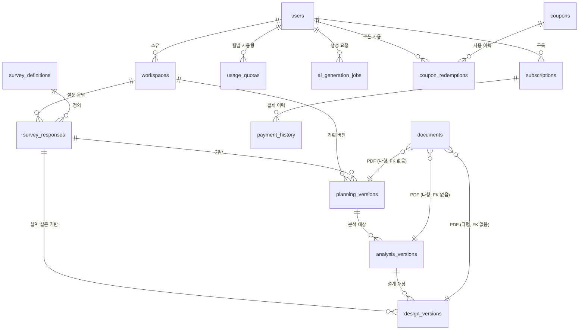

# 데이터베이스 스키마 레퍼런스

이 문서는 `database/migarations/`(V1~V10) Flyway 마이그레이션을 실제로 적용했을 때 만들어지는 **현재 시점의
최종 스키마**를 테이블 단위로 정리한 기술 레퍼런스다. 왜 이런 구조를 택했는지에 대한 설계 배경/트레이드오프는
[03_design.md §5](./03_design.md)에 이미 정리돼 있으니 여기서는 반복하지 않고, "지금 DB에 실제로 무엇이
있는가"를 빠르게 찾아보는 용도로 쓴다. 마이그레이션 파일 자체가 항상 정답(source of truth)이며, 이 문서는
그 스냅샷이다 — 새 마이그레이션을 추가하면 이 문서도 함께 갱신한다.

## 1. ERD

`documents`/`ai_generation_jobs`의 `source_id`/`target_id`는 `PLANNING`/`ANALYSIS`/`DESIGN` 셋 중 하나를
가리키는 다형(polymorphic) 참조라 실제 DB에는 FK 제약이 없다(애플리케이션이 `source_type`/`target_type`으로
분기해 조회). 위 다이어그램에서는 관계를 표현하기 위해 셋 다 그려뒀을 뿐, 실제 스키마상의 FK는 아니다.

## 2. 테이블

### 2-1. 인증/회원 — `users`

| 컬럼 | 타입 | 제약 | 추가 버전 |
| --- | --- | --- | --- |
| `id` | UUID | PK, `gen_random_uuid()` | V1 |
| `email` | VARCHAR(320) | NOT NULL, UNIQUE | V1 |
| `name` | VARCHAR(50) | NULL 허용 | V10 |
| `password_hash` | VARCHAR(255) | NULL 허용(OAuth 계정은 없음) | V1 |
| `provider` | VARCHAR(20) | NOT NULL, CHECK IN (`LOCAL`,`GOOGLE`,`APPLE`) | V1 |
| `provider_id` | VARCHAR(255) | NULL 허용 | V1 |
| `role` | VARCHAR(20) | NOT NULL DEFAULT `USER`, CHECK IN (`USER`,`ADMIN`) | V1 |
| `plan` | VARCHAR(20) | NOT NULL DEFAULT `FREE`, CHECK IN (`FREE`,`PRO`) | V1 |
| `pro_expires_at` | TIMESTAMPTZ | NULL 허용 | V9 |
| `temp_ban_until` | TIMESTAMPTZ | NULL 허용 | V9 |
| `permanent_ban` | BOOLEAN | NOT NULL DEFAULT `false` | V9 |
| `withdrawn_at` | TIMESTAMPTZ | NULL 허용 | V6 |
| `created_at` / `updated_at` | TIMESTAMPTZ | NOT NULL DEFAULT `now()` | V1 |

- `UNIQUE(provider, provider_id)` — 같은 OAuth 계정으로 중복 가입 방지.
- `password_hash`가 NULL이면 반드시 `provider != LOCAL`(OAuth 전용 계정)이라는 뜻 — DB 제약이 아니라
  애플리케이션(`AuthService`)이 지키는 불변식이다.
- `name`이 NULL이면 프론트가 이메일 앞부분으로 대체 표시한다(표시 로직은 서버가 아닌 클라이언트 책임).
- 탈퇴(`withdraw()`)는 하드 삭제 대신 `email`을 `withdrawn-<id>@deleted.local`로 익명화하고
  `withdrawn_at`을 채운다 — `subscriptions`/`payment_history`/`workspaces` 등이 FK로 참조해 하드 삭제가
  불가능하고, 결제 이력은 세무/분쟁 대응을 위해 보존해야 하기 때문.
- 제재 유효 여부는 `permanent_ban OR (temp_ban_until IS NOT NULL AND temp_ban_until > now())`.

### 2-2. 워크스페이스 — `workspaces`

| 컬럼 | 타입 | 제약 |
| --- | --- | --- |
| `id` | UUID | PK |
| `user_id` | UUID | NOT NULL, FK → `users(id)`, 인덱스 |
| `name` | VARCHAR(255) | NOT NULL |
| `status` | VARCHAR(20) | NOT NULL DEFAULT `ACTIVE`, CHECK IN (`ACTIVE`) |
| `deleted_at` | TIMESTAMPTZ | NULL 허용(소프트 삭제) |
| `created_at` / `updated_at` | TIMESTAMPTZ | NOT NULL DEFAULT `now()` |

`status`는 V1 시점엔 값이 미확정이라 CHECK 없이 열어뒀다가 V3에서 `'ACTIVE'` 하나만 허용하도록 확정했다
(다른 상태 전이가 요구사항에 없어 소프트 삭제만으로 충분하다고 판단).

### 2-3. 설문 — `survey_definitions` / `survey_responses`

**`survey_definitions`** — Admin이 발행하는 설문 정의(문항 스키마), 불변.

| 컬럼 | 타입 | 제약 |
| --- | --- | --- |
| `id` | UUID | PK |
| `survey_key` | VARCHAR(50) | NOT NULL, CHECK IN (`PLANNING_HAS_IDEA`,`PLANNING_EXPLORING`,`DESIGN`) |
| `version` | INT | NOT NULL |
| `title` | VARCHAR(255) | NOT NULL |
| `schema` | JSONB | NOT NULL — 문항 구조. 암호화 대상 아님(사용자 데이터가 아니라 Admin이 만든 정의) |
| `created_at` | TIMESTAMPTZ | NOT NULL DEFAULT `now()` |

`UNIQUE(survey_key, version)` — 같은 설문의 새 버전은 새 행으로 추가되고 기존 버전은 절대 수정하지 않는다
(과거 응답이 어떤 문항 구조를 기준으로 제출됐는지 항상 재구성 가능해야 하므로).

**`survey_responses`** — 사용자가 제출한 응답, 불변.

| 컬럼 | 타입 | 제약 |
| --- | --- | --- |
| `id` | UUID | PK |
| `survey_definition_id` | UUID | NOT NULL, FK → `survey_definitions(id)`, 인덱스 |
| `workspace_id` | UUID | NOT NULL, FK → `workspaces(id)`, 인덱스 |
| `answers` | TEXT | NOT NULL, **암호화**(AES-256-GCM) |
| `submitted_at` | TIMESTAMPTZ | NOT NULL DEFAULT `now()` |

`updated_at`이 없다 — 제출 후 수정 불가(불변 레코드), UPDATE는 애플리케이션 레벨에서 아예 금지한다.
`answers`는 암호문이라 유효한 JSON이 아닐 수 있어(JSONB 컬럼에 담을 수 없음) TEXT로 저장하고,
JPA `AttributeConverter`(`EncryptedStringConverter`)가 저장/조회 시 암복호화한다.

### 2-4. 기획/분석/설계 버전

세 테이블 모두 같은 패턴(버전 번호, 암호화된 content, 상태, 소프트 삭제)을 공유한다.

| 테이블 | 상위 참조 | 버전 유니크 제약 |
| --- | --- | --- |
| `planning_versions` | `workspace_id` FK, `survey_response_id` FK | `UNIQUE(workspace_id, version_no)` |
| `analysis_versions` | `planning_version_id` FK | `UNIQUE(planning_version_id, version_no)` |
| `design_versions` | `analysis_version_id` FK, `survey_response_id` FK(설계 설문) | `UNIQUE(analysis_version_id, version_no)` |

공통 컬럼: `id`(PK), `version_no`(INT NOT NULL), `content`(TEXT, 암호화, NULL 허용 — 생성 중엔 비어있음),
`status`(VARCHAR(20) NOT NULL DEFAULT `GENERATING`, CHECK IN `GENERATING`/`COMPLETED`/`FAILED`),
`deleted_at`(NULL 허용, 소프트 삭제), `created_at`/`updated_at`.

- `analysis_versions`는 `survey_response_id`가 없다 — 분석은 새 설문 없이 기획안 내용만으로 생성되기 때문.
- 상위 버전(예: 기획)이 소프트 삭제돼도 이를 참조하는 하위 버전(분석/설계)은 조회는 가능하되 재생성은
  막는다(애플리케이션 레벨 규칙).

### 2-5. 산출물 / 비동기 생성

**`documents`** — PDF 산출물(Supabase Storage 경로).

| 컬럼 | 타입 | 제약 |
| --- | --- | --- |
| `id` | UUID | PK |
| `source_type` | VARCHAR(20) | NOT NULL, CHECK IN (`PLANNING`,`ANALYSIS`,`DESIGN`) |
| `source_id` | UUID | NOT NULL — 다형 참조, **FK 없음** |
| `file_url` | VARCHAR(500) | NOT NULL |
| `generated_at` | TIMESTAMPTZ | NOT NULL DEFAULT `now()` |

인덱스: `(source_type, source_id)`.

**`ai_generation_jobs`** — 비동기 생성 Job, 폴링용.

| 컬럼 | 타입 | 제약 | 추가 버전 |
| --- | --- | --- | --- |
| `id` | UUID | PK | V1 |
| `target_type` | VARCHAR(20) | NOT NULL, CHECK IN (`PLANNING`,`ANALYSIS`,`DESIGN`) | V1 |
| `target_id` | UUID | NOT NULL — 다형 참조, FK 없음 | V1 |
| `user_id` | UUID | NOT NULL, FK → `users(id)` | V4 |
| `status` | VARCHAR(20) | NOT NULL DEFAULT `PENDING`, CHECK IN (`PENDING`,`PROCESSING`,`COMPLETED`,`FAILED`) | V1 |
| `error_message` | TEXT | NULL 허용 | V1 |
| `created_at` / `updated_at` | TIMESTAMPTZ | NOT NULL DEFAULT `now()` | V1 |

`user_id`는 V1 설계엔 없었다 — Job 상태 폴링 API가 "본인이 만든 Job만 조회"하려면 소유자가 필요한데,
`target_id`가 다형 참조라 target 테이블 조인으로 소유권을 확인할 수 없어 V4에서 Job 자신에 소유자 컬럼을
직접 추가했다. 인덱스: `(target_type, target_id)`, `user_id`.

### 2-6. 구독/결제

**`subscriptions`**

| 컬럼 | 타입 | 제약 | 추가 버전 |
| --- | --- | --- | --- |
| `id` | UUID | PK | V1 |
| `user_id` | UUID | NOT NULL, FK → `users(id)`, 인덱스 | V1 |
| `plan` | VARCHAR(20) | NOT NULL, CHECK IN (`FREE`,`PRO`) | V1 |
| `status` | VARCHAR(20) | NOT NULL DEFAULT `ACTIVE`, CHECK IN (`ACTIVE`,`PAST_DUE`,`CANCELED`) | V1 |
| `billing_key` | TEXT | NULL 허용, **암호화** | V1 |
| `next_billing_at` | TIMESTAMPTZ | NULL 허용 | V1 |
| `next_payment_schedule_id` | TEXT | NULL 허용 | V7 |
| `started_at` | TIMESTAMPTZ | NOT NULL DEFAULT `now()` | V1 |
| `expires_at` | TIMESTAMPTZ | NULL 허용 | V1 |
| `created_at` / `updated_at` | TIMESTAMPTZ | NOT NULL DEFAULT `now()` | V1 |

실제 결제 성공/실패는 PortOne 웹훅으로만 확정되므로, 생성 직후엔 `PAST_DUE`(대기)로 시작해 웹훅이
`ACTIVE`로 전환한다. `next_payment_schedule_id`는 사용자가 해지할 때 PortOne에 등록된 다음 결제 예약을
실제로 취소(revoke)하기 위한 값 — paymentId/scheduleId는 매번 랜덤 생성돼 재계산이 불가능해 별도 보관한다.

**`payment_history`**

| 컬럼 | 타입 | 제약 |
| --- | --- | --- |
| `id` | UUID | PK |
| `subscription_id` | UUID | NOT NULL, FK → `subscriptions(id)`, 인덱스 |
| `payment_id` | VARCHAR(255) | NOT NULL, UNIQUE — PortOne 웹훅 멱등 처리 키 |
| `amount` | BIGINT | NOT NULL(KRW, 소수 단위 없음) |
| `status` | VARCHAR(20) | NOT NULL, CHECK IN (`PAID`,`FAILED`) |
| `paid_at` | TIMESTAMPTZ | NULL 허용 |
| `created_at` | TIMESTAMPTZ | NOT NULL DEFAULT `now()` |

**`subscription_pricing`**(V8) — 단일 행 설정 테이블(가격/프로모션).

| 컬럼 | 타입 | 제약 |
| --- | --- | --- |
| `id` | UUID | PK |
| `base_price_krw` | BIGINT | NOT NULL, CHECK `>= 0` |
| `promo_price_krw` | BIGINT | NULL 허용, CHECK `>= 0`(NULL이면 프로모션 없음) |
| `promo_starts_at` / `promo_ends_at` | TIMESTAMPTZ | NULL 허용 |
| `created_at` / `updated_at` | TIMESTAMPTZ | NOT NULL DEFAULT `now()` |

CHECK 제약으로 `promo_*` 세 컬럼이 **전부 NULL(프로모션 없음)** 또는 **전부 채워짐(진행 중)** 둘 중
하나만 허용하고, 채워졌다면 `promo_ends_at > promo_starts_at`도 강제한다. 유효가는 애플리케이션이
`now() ∈ [promo_starts_at, promo_ends_at)`이고 `promo_price_krw`가 있으면 그 값을, 아니면
`base_price_krw`를 청구 금액으로 쓴다(가입 시점 가격을 잠그지 않음).

### 2-7. AI 사용량/한도

**`usage_quotas`** — 월별 AI 생성 횟수 카운터.

| 컬럼 | 타입 | 제약 |
| --- | --- | --- |
| `id` | UUID | PK |
| `user_id` | UUID | NOT NULL, FK → `users(id)` |
| `period` | VARCHAR(7) | NOT NULL, `'YYYY-MM'` 형식 |
| `generation_count` | INT | NOT NULL DEFAULT `0` |
| `limit_count` | INT | NOT NULL — row 생성 시점의 한도를 그대로 박아둠(이후 관리자가 한도를 바꿔도 소급 반영 안 됨) |

`UNIQUE(user_id, period)`. 동시 요청에 대한 체크-후-증가는 `pg_advisory_xact_lock`으로 직렬화한다
(애플리케이션 레벨, `UsageQuotaService`).

**`free_tier_settings`**(V5, V10에서 컬럼 분리) — 단일 행 설정 테이블.

| 컬럼 | 타입 | 제약 | 비고 |
| --- | --- | --- | --- |
| `id` | UUID | PK | |
| `free_monthly_limit` | INT | NOT NULL | V5엔 `monthly_limit`이라는 단일 컬럼이었으나 V10에서 이 이름으로 rename |
| `pro_monthly_limit` | INT | NOT NULL DEFAULT `10` | V10 신설 — 그 전까지 PRO는 무제한이었음 |
| `created_at` / `updated_at` | TIMESTAMPTZ | NOT NULL DEFAULT `now()` | |

**`prompt_templates`**(V5) — Claude Tool Use에 쓰이는 시스템 프롬프트/스키마, Admin이 버전 발행.

| 컬럼 | 타입 | 제약 |
| --- | --- | --- |
| `id` | UUID | PK |
| `prompt_type` | VARCHAR(20) | NOT NULL, CHECK IN (`PLANNING`,`ANALYSIS`,`DESIGN`) |
| `version` | INT | NOT NULL |
| `tool_name` | VARCHAR(255) | NOT NULL |
| `tool_description` | TEXT | NOT NULL |
| `system_prompt` | TEXT | NOT NULL |
| `schema_json` | TEXT | NOT NULL — Claude에 그대로 전달되는 JSON Schema 문자열(애플리케이션이 파싱하지 않아 JSONB 아닌 TEXT) |
| `created_at` | TIMESTAMPTZ | NOT NULL DEFAULT `now()` |

`UNIQUE(prompt_type, version)` — `survey_definitions`와 동일하게 불변 버전 발행 패턴.

### 2-8. 쿠폰 / 제재 (V9)

**`coupons`**

| 컬럼 | 타입 | 제약 |
| --- | --- | --- |
| `id` | UUID | PK |
| `code` | VARCHAR(64) | NOT NULL, UNIQUE — 관리자가 직접 지정(자동생성 아님) |
| `benefit_days` | INT | NOT NULL, CHECK `> 0` |
| `max_redemptions` | INT | NULL 허용(NULL = 무제한) |
| `redemption_count` | INT | NOT NULL DEFAULT `0` |
| `expires_at` | TIMESTAMPTZ | NULL 허용(NULL = 코드 자체 사용 기한 없음) |
| `active` | BOOLEAN | NOT NULL DEFAULT `true` |
| `created_at` / `updated_at` | TIMESTAMPTZ | NOT NULL DEFAULT `now()` |

**`coupon_redemptions`**

| 컬럼 | 타입 | 제약 |
| --- | --- | --- |
| `id` | UUID | PK |
| `coupon_id` | UUID | NOT NULL, FK → `coupons(id)` |
| `user_id` | UUID | NOT NULL, FK → `users(id)` |
| `redeemed_at` | TIMESTAMPTZ | NOT NULL DEFAULT `now()` |
| `granted_until` | TIMESTAMPTZ | NOT NULL — 이 쿠폰으로 연장된 `users.pro_expires_at` 스냅샷 |

`UNIQUE(coupon_id, user_id)` — 동일 유저의 같은 코드 중복 사용을 DB 레벨에서 막는다(다른 유저가 같은
코드를 각자 한 번씩 쓰는 건 허용). 동시 요청으로 `max_redemptions`를 넘겨 지급되는 경합은
`pg_advisory_xact_lock`으로 코드 단위 직렬화해 막는다(Phase 21에서 추가, `CouponService`).

## 3. 횡단 관심사

- **암호화**: 사용자의 사업 아이디어/결제 수단이 담긴 5개 컬럼(`survey_responses.answers`,
  `planning_versions.content`, `analysis_versions.content`, `design_versions.content`,
  `subscriptions.billing_key`)은 JPA `AttributeConverter`(`EncryptedStringConverter`, AES-256-GCM)로
  애플리케이션 레벨 암호화한다. 검색/통계 대상이 아니라 쿼리 제약은 없다.
- **소프트 삭제**: `workspaces`/`planning_versions`/`analysis_versions`/`design_versions`는
  `deleted_at` 기반. 회원 탈퇴만 예외적으로 개인정보를 익명화하는 방식(하드 삭제 아님, §2-1 참고)을 쓴다.
- **다형 참조**: `documents.source_id`, `ai_generation_jobs.target_id`는 DB FK가 없다 — `source_type`/
  `target_type`으로 어느 버전 테이블을 가리키는지 애플리케이션이 분기해서 조회한다.
- **단일 행 설정 테이블**: `free_tier_settings`/`subscription_pricing`은 항상 정확히 한 행만 존재하는
  전역 설정값이다(Admin이 조회/갱신). 재배포 없이 값을 바꾸기 위한 용도.
- **RLS(Row Level Security)**: 모든 도메인 테이블에 `ENABLE ROW LEVEL SECURITY`를 걸어두되 정책은
  하나도 두지 않는다. Backend는 Supabase Session Pooler로 테이블 소유자 권한 JDBC 연결을 쓰는데,
  PostgreSQL은 기본적으로 소유자에게 RLS를 적용하지 않아(`FORCE ROW LEVEL SECURITY` 미설정) backend
  접근엔 영향이 없고, Supabase가 자동 노출하는 PostgREST Data API(소유자 아님)만 완전히 차단된다.

## 4. 마이그레이션 히스토리

| 버전 | 요약 |
| --- | --- |
| V1 | 초기 스키마 — 12개 테이블 전체 생성 |
| V2 | 전체 테이블 RLS 활성화 |
| V3 | `workspaces.status` 허용 값을 `ACTIVE` 하나로 확정 |
| V4 | `ai_generation_jobs.user_id` 추가(소유자 조회용) |
| V5 | `prompt_templates`, `free_tier_settings` 신설 + 초기 프롬프트/한도 시드 |
| V6 | `users.withdrawn_at` 추가(회원 탈퇴) |
| V7 | `subscriptions.next_payment_schedule_id` 추가(해지 시 PortOne 예약 취소용) |
| V8 | `subscription_pricing` 신설(가격/프로모션 관리) |
| V9 | `users.pro_expires_at`/`temp_ban_until`/`permanent_ban` 추가, `coupons`/`coupon_redemptions` 신설 |
| V10 | `free_tier_settings`를 FREE/PRO 이중 한도로 분리, `users.name` 추가 |

새 마이그레이션은 `database/migarations/V<n>__설명.sql`로 추가하고([README](../README.md) 참고),
이 문서의 해당 섹션과 위 히스토리 표를 함께 갱신한다.
