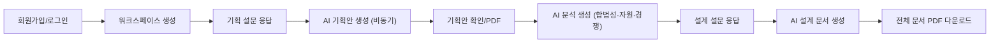
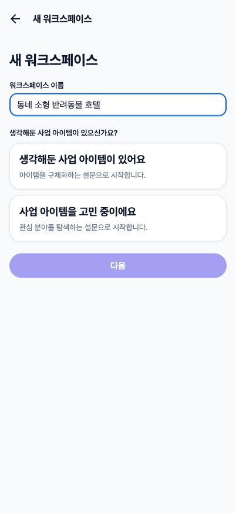
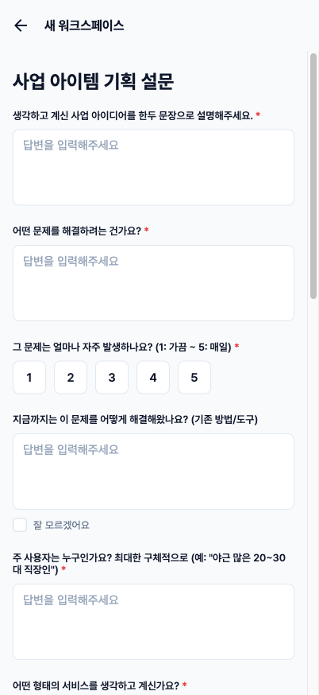
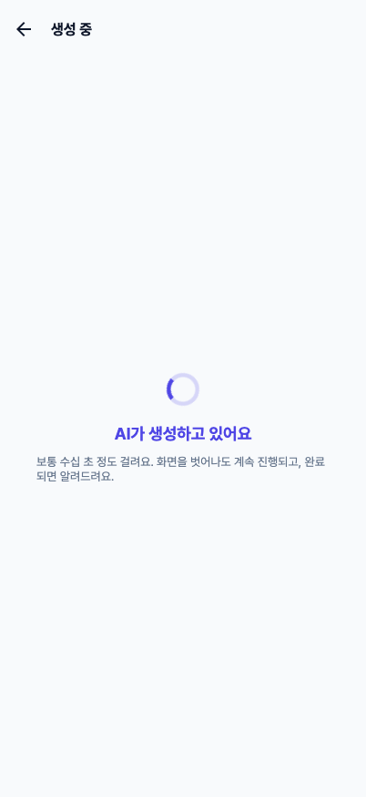
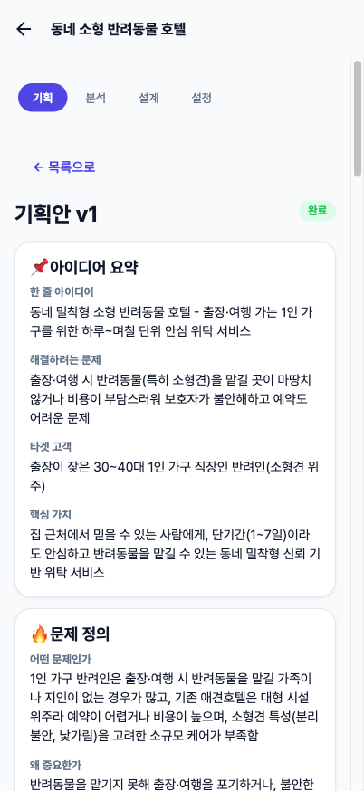
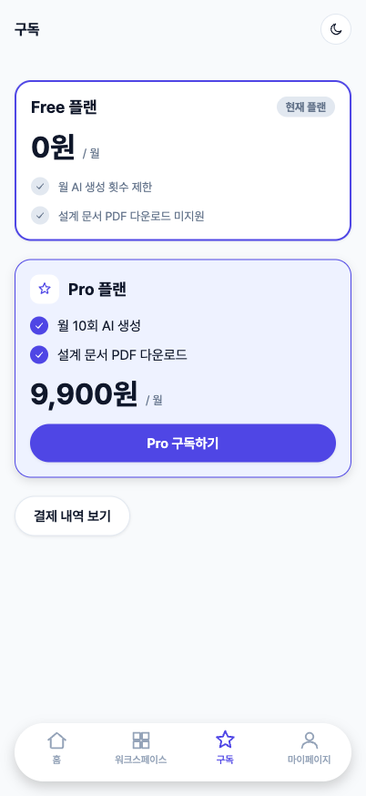
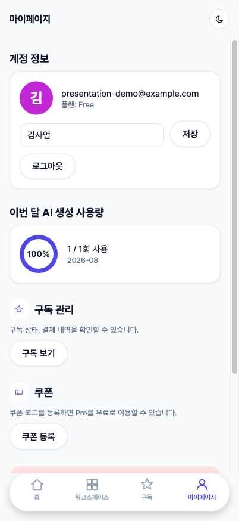
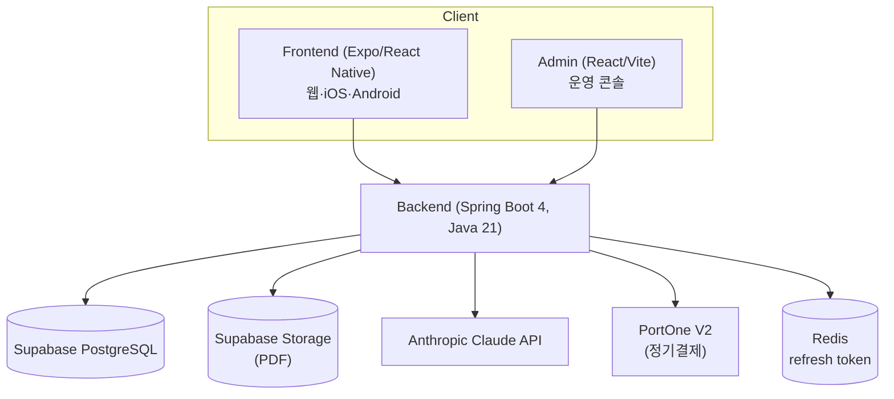

# 알려드림(alrdream) — 프로젝트 발표 자료

> 이 문서는 PPT 제작을 위한 발표용 요약이다. 각 `#` 섹션을 슬라이드 한 장으로 옮기면 된다. 더 자세한 내용은
> [01_planning_and_analysis.md](./01_planning_and_analysis.md), [03_design.md](./03_design.md),
> [04_milestone.md](./04_milestone.md), [06_schema.md](./06_schema.md)를 참고.

---

# 1. 한 줄 소개

**알려드림**은 사용자의 사업 아이디어를 입력받아 AI가 **기획 → 분석 → 설계**까지 단계적으로 자동 생성해주는
워크스페이스형 서비스다.

- "아이디어는 있는데 사업계획서를 어떻게 써야 할지 모르겠다"는 예비 창업자를 위한 서비스
- 설문에 답하면 AI가 구조화된 기획안 → 실행 가능성 분석 → 개발 가능한 설계 문서까지 순차적으로 만들어준다
- 워크스페이스 단위로 관리하고, 각 단계는 버전 관리되며 언제든 다시 생성(재생성)할 수 있다

# 2. 문제의식

| 기존 방식 | 알려드림 |
| --- | --- |
| 사업계획서 템플릿을 보고 스스로 채워야 함 | 설문에 답하기만 하면 AI가 구조화된 초안 작성 |
| "이 아이디어가 실행 가능한가?"를 스스로 판단해야 함 | 합법성/자원/경쟁 구도를 AI가 별도 분석 단계로 짚어줌 |
| 기획 이후 "그래서 뭘 만들어야 하나"가 막막함 | 분석 결과를 바탕으로 실제 개발 가능한 설계 문서까지 이어짐 |
| 여러 버전을 손으로 관리 | 버전별로 자동 저장, 이전 버전과 비교(diff) 가능 |

# 3. 핵심 사용 흐름

기획/분석/설계 각 단계는 독립적으로 재생성할 수 있고, 이전 버전은 그대로 보존된다(버전 비교 뷰 제공).

---

# 4. 실제 화면으로 보는 흐름

아래 스크린샷은 실제로 동작하는 개발 서버에서 테스트 계정으로 직접 캡처한 것이다(합성 이미지 아님).

## 4-1. 회원가입

이메일/비밀번호 또는 Google 로그인. 비밀번호 입력란은 표시/숨기기 토글을 지원한다.

## 4-2. 새 워크스페이스 생성

"생각해둔 아이템이 있다" / "아직 고민 중이다" 두 갈래로 시작 설문이 달라진다.

## 4-3. 기획 설문

장문형/단일선택/다중선택/척도 등 다양한 문항 타입을 지원하고, "잘 모르겠어요"로 답해도 AI가 일반적인 시장
정보를 바탕으로 조사·제안한다.

## 4-4. AI 생성 중

생성은 수십 초가 걸리는 비동기 작업이라 폴링으로 진행 상태를 보여준다. 이 화면을 벗어나도(다른 화면 이동)
추적이 끊기지 않고, 완료되면 어디에 있든 배너로 알려준다.

## 4-5. AI가 생성한 기획안 (실제 결과물)

"동네 소형 반려동물 호텔"이라는 테스트 아이디어로 실제 생성한 결과다. 아이디어 요약부터 문제 정의, 타겟
분석, 경쟁 분석, 수익 모델, MVP 전략, 실행 로드맵, 리스크까지 10개 섹션을 구조화된 형태로 자동 생성한다.
"잘 모르겠어요"로 답한 문항은 AI가 스스로 조사한 내용임을 "(AI 조사)"로 표시해 구분한다.

## 4-6. 워크스페이스 목록 (다크 모드)

라이트/다크 테마를 모두 지원한다. 하단 플로팅 탭바 + FAB 버튼 형태의 구조적 리디자인을 거쳤다(Phase 20).

## 4-7. 구독 (Free/Pro)

Free는 월 1회, Pro(월 9,900원)는 월 10회 AI 생성 + 설계 문서 PDF 다운로드를 제공한다. 포트원(PortOne) V2
연동으로 실제 정기결제(빌링키) 구독이 가능하다.

## 4-8. 마이페이지

표시 이름 변경, 이번 달 AI 생성 사용량(원형 진행률), 구독/쿠폰 관리, 2단계 확인을 거치는 회원 탈퇴까지
한 화면에서 관리한다.

---

# 5. 시스템 구성

| 영역 | 스택 |
| --- | --- |
| Frontend | Expo(React Native), Expo Router, react-native-web — 웹/iOS/Android 하나의 코드베이스 |
| Admin | React, Vite, TypeScript |
| Backend | Spring Boot 4, Java 21, Spring Data JPA + Querydsl, Flyway, Spring Data Redis |
| DB/Storage | Supabase(PostgreSQL + S3 호환 Storage) |
| AI | Anthropic Claude API(Tool Use로 구조화된 JSON 응답) |
| 결제 | 포트원(PortOne) V2, PG사 토스페이먼츠 |
| 배포 | Backend→Render, Admin→Vercel, Frontend→EAS(내부 테스트 배포) |

자세한 도메인 구조/스키마는 [03_design.md](./03_design.md), [06_schema.md](./06_schema.md) 참고.

# 6. 도메인 하이라이트

- **인증**: 이메일/비밀번호 + Google/Apple 소셜 로그인, JWT Access/Refresh 자체 발급(Redis에 refresh 저장,
  로테이션), 비밀번호 재설정(이메일 코드)
- **비동기 AI 생성**: 기획/분석/설계 생성 요청은 즉시 Job을 만들고 백그라운드로 처리, 클라이언트는 전역
  폴링으로 어느 화면에 있든 완료/실패를 안다
- **버전 관리**: 모든 산출물은 버전 단위로 저장·소프트 삭제되며, 이전 버전과 필드 단위 diff 비교 지원
- **암호화**: 사용자의 사업 아이디어가 담긴 설문 응답/기획·분석·설계 콘텐츠, 결제 빌링키는 AES-256-GCM으로
  애플리케이션 레벨 암호화
- **구독/결제**: PortOne 빌링키 기반 정기결제, 웹훅으로 결제 상태 확정(멱등 처리), 해지 시 실제 PortOne
  예약도 함께 취소
- **AI 사용량 한도**: Free/Pro 모두 월별 한도 적용(관리자가 Admin에서 조정 가능), 동시 요청에 안전한
  advisory lock으로 한도 초과 방지
- **쿠폰/제재**: 관리자가 발급하는 쿠폰으로 Pro 기간 지급, 일시/영구 계정 제재(제재 시 발급된 토큰도 즉시 차단)
- **Admin 콘솔**: 가입자 통계, 사용자 관리(플랜 변경/제재), 설문·프롬프트 템플릿 버전 관리, 가격/프로모션
  관리를 하나의 콘솔에서

# 7. 개발 과정

Phase 00부터 순차적으로 스캐폴딩 → 도메인별 백엔드 → Admin → Frontend → UI 개편 → 전수 점검 순으로
진행했다(총 22개 Phase, [전체 기록](./04_milestone.md)).

| 구간 | 내용 |
| --- | --- |
| Phase 00~02 | 프로젝트 스캐폴딩, 배포 파이프라인 최소 구성, DB 스키마 초기 설계 |
| Phase 03~11 | 인증/워크스페이스/설문/AI 연동/기획·분석·설계 도메인/PDF/구독·결제 백엔드 순차 구현 |
| Phase 12~13 | Admin 콘솔, Frontend(사용자) 앱 |
| Phase 14, 17 | UI/디자인 폴리싱(2차례) |
| Phase 15, 21 | **기능/비기능 전수 점검** — 병렬 에이전트로 backend/admin/frontend 전체를 다시 감사하고
  발견한 버그를 실서버에서 재현·검증 후 수정 |
| Phase 16, 18~20 | 비밀번호 재설정, 회원 탈퇴, Admin 대시보드 통계, 버전 비교, 쿠폰/제재 시스템, 구조적
  리디자인, Free/Pro 이중 한도 등 후속 기능 |
| Phase 22 | 문서 정리(이 문서 포함) |

## 전수 점검에서 실제로 잡은 문제들 (일부)

두 차례(Phase 15, 21)의 전수 점검에서 정적 분석 + 실서버 라이브 재현을 병행해 다음과 같은 문제를 출시 전에
잡았다 — 전체 목록은 [04_milestone.md](./04_milestone.md) Phase 15/21 참고.

- 결제 성공 후 예외가 나면 결제 기록이 롤백으로 사라지는 트랜잭션 경계 버그
- 여러 사용자가 동시에 같은 쿠폰을 상환하면 사용 한도를 초과해 지급될 수 있는 동시성 경합
- 회원 탈퇴 1차 확인 절차가 기존 로그인 세션을 깨뜨리던 버그
- 탈퇴한 계정의 기존 토큰이 만료 전까지 계속 유효했던 문제
- 토큰 갱신 중 로그아웃하면 다시 로그인된 것처럼 보이던 경합 조건

# 8. 품질 관리

- **테스트**: 세 앱 모두 단위 테스트 보유(Backend: JUnit5+Mockito, Admin: Vitest, Frontend: Jest) — 토큰
  갱신/로그아웃 경합, 쿠폰 검증, OIDC nonce 검증 등 실제로 버그가 났던 로직 위주
- **보안 점검**: 인가(IDOR) 라이브 테스트(다른 사용자 토큰으로 접근 시도), 관리자 전용 API에 위조 토큰
  접근 시도, SQL 인젝션/웹훅 서명 검증/민감정보 암호화 확인
- **정적 검증**: 세 앱 모두 컴파일/타입체크/린트를 매 변경 후 통과 확인

# 9. 남은 작업

- 프로덕션 릴리즈 최종 점검(환경변수/시크릿 등록, PortOne 웹훅 도메인 등록, EAS 내부 배포, E2E 스모크
  테스트) — [04_milestone.md](./04_milestone.md) 마지막 Phase 참고
- 스토어 정식 출시는 이번 프로젝트 스코프 밖(내부/테스트 배포까지)
